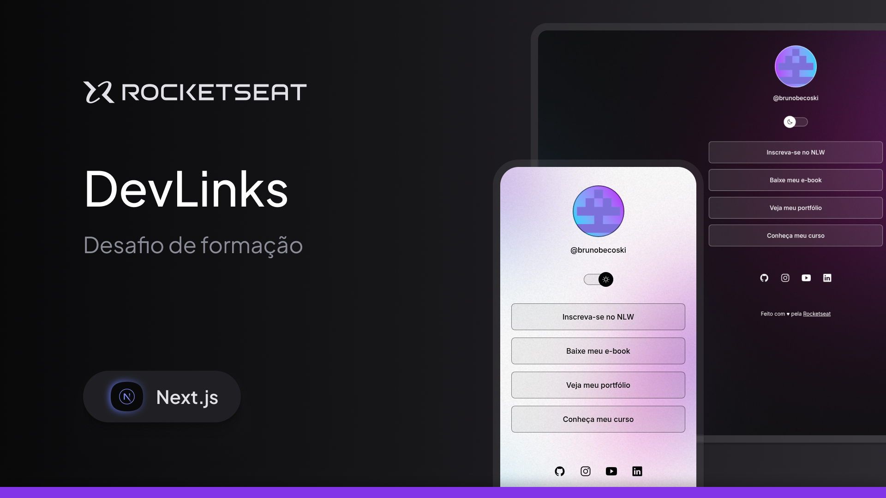
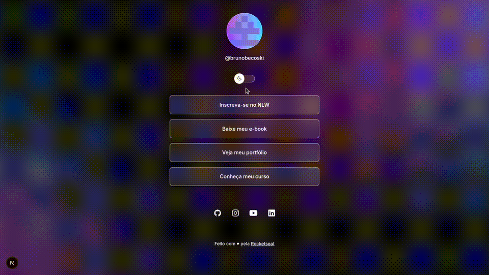

DevLinks é um agregador de links responsivos com a troca de tema.


## Para iniciar

Primeiro instale as dependências:

```bash
npm install
# or
pnpm install
```

Rode o projeto:

```bash
npm run dev
# or
pnpm dev
```

Abra [http://localhost:3000](http://localhost:3000) no seu 
navegador para ver o projeto.


| content |       |     | 
| ------- | ----- | --- |
| avatar  |       |     | 
| name    |       |     |
| links   | title | url |
| socials | name  | url |
 
